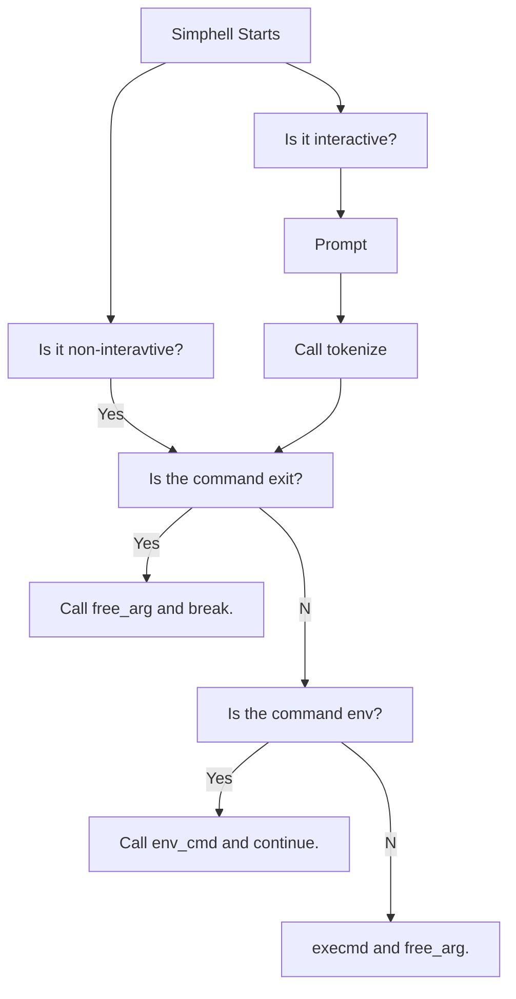

#**Project**'Monty'

## Introduction
> This README is for the Monty project at Holberton. It countains the requirements, allowed functions and system calls, prototypes, compiler used, and a list of files.

### Requirements
- Allowed editors: vi, vim, emacs
- All your files will be compiled on Ubuntu 20.04 LTS
- Your code should use the Betty style.
- Max of One Global Variables
- May use Standard C library
- No more than 5 functions per file
- Header files should be include guarded
- Only use system calls when needed

##### Prototypes
- int main(int argc, char **argv)

##### Compilation
`$ gcc -Wall -Werror -Wextra -pedantic *.c -o monty'

### Repo Files
| **File** | *__Description__* |
|----------|----------------:|
|main.h|Header file containing all structs and prototypes used|
|simphell.c| File that contains the main function for creating a shell and the free_args function to free variable arg|
|tokenize.c|Reads the input and breaks it down into tokens|
|print_env.c| Contains the function for printing the environment|
|execmd.c| Contains the execmd function that forks the process and runs a command|
|find_location.c| Contains the function for finding the environment path of a command and checking that the command exists|
|_getenv| Finds the PATH variable from the environment|

### Flow charts

#### Simphell

